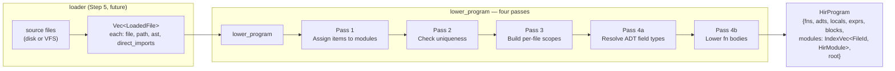
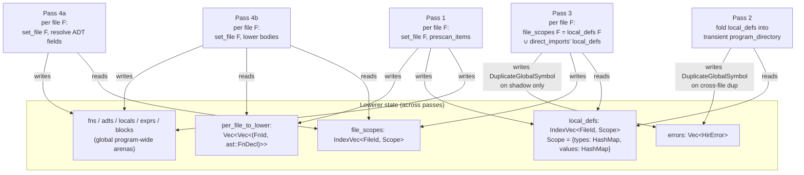
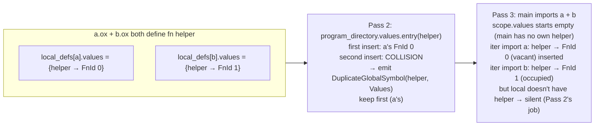

# `lower_program` four passes

How the multi-file HIR lowerer (`src/hir/lower.rs::lower_program`)
turns `Vec<LoadedFile>` into a `HirProgram`. Single-file `lower(ast)`
is a degenerate case — one file, no imports, file_scopes = local_defs.

## Top-level flow



## What each pass reads and writes



## Worked example — diamond

```text
main.ox  ──┬──▶ a.ox ─▶ util.ox
           └──▶ b.ox ─▶ util.ox
```

```mermaid
flowchart TB
    subgraph Input["Vec&lt;LoadedFile&gt; (loader output)"]
        M["main (file=0)<br/>direct_imports: [1, 2]"]
        A["a (file=1)<br/>direct_imports: [3]"]
        B["b (file=2)<br/>direct_imports: [3]"]
        U["util (file=3)<br/>direct_imports: []"]
    end

    subgraph AfterP1["After Pass 1 — local_defs"]
        LD0["local_defs[0] (main)<br/>values: {main → FnId 0}"]
        LD1["local_defs[1] (a)<br/>values: {from_a → FnId 1}"]
        LD2["local_defs[2] (b)<br/>values: {from_b → FnId 2}"]
        LD3["local_defs[3] (util)<br/>values: {helper → FnId 3}"]
    end

    subgraph AfterP2["After Pass 2 — program_directory (transient)"]
        PD["program_directory<br/>values: {main: 0, from_a: 1,<br/>from_b: 2, helper: 3}<br/><br/>no collisions, dropped"]
    end

    subgraph AfterP3["After Pass 3 — file_scopes"]
        FS0["file_scopes[0] (main)<br/>values: {main, from_a, from_b}<br/>(NOT helper — non-transitive)"]
        FS1["file_scopes[1] (a)<br/>values: {from_a, helper}"]
        FS2["file_scopes[2] (b)<br/>values: {from_b, helper}"]
        FS3["file_scopes[3] (util)<br/>values: {helper}"]
    end

    subgraph P4Resolution["Pass 4b — name resolution per file"]
        R0["main calls from_a, from_b<br/>both resolve via file_scopes[0]"]
        R1["a calls helper<br/>resolves to FnId 3 via file_scopes[1]"]
        R2["b calls helper<br/>resolves to FnId 3 via file_scopes[2]"]
    end

    Input --> AfterP1
    AfterP1 --> AfterP2
    AfterP2 --> AfterP3
    AfterP3 --> P4Resolution
```



Key points:
- **One `helper`**, even though both `a.ox` and `b.ox` import
  `util.ox` — `util.ox` is loaded once by the loader and gets one
  `FnId`.
- **`main.ox` cannot see `helper`**: `file_scopes[0]` only contains
  what `main.ox` directly imports (`a.ox`, `b.ox`), not what those
  files transitively import. Calling `helper()` from `main.ox`
  directly would emit `UnresolvedName`.
- **`set_file(F, ast)`** between Pass 4 iterations swaps the
  lowerer's `(self.file, self.ast)` so name lookups
  (`file_scopes[self.file]`) and AST-arena reads (`self.ast.exprs[…]`)
  hit the right file's data.

## Collision case

Two files defining the same name — Pass 2 fires once, Pass 3 stays
silent:



Shadow case (file's own def + import collide) is the *only* time
Pass 3 emits a diagnostic.

## Why split into so many passes

Each pass has one job, and each later pass depends on the previous:

| Pass | Why it must come before the next |
|------|----------------------------------|
| 1 | Allocates IDs. Later passes need every fn/ADT to exist (forward references). |
| 2 | Detects cross-file dups before resolution sees them. |
| 3 | Builds the resolution scope. Pass 4 reads from `file_scopes`. |
| 4a | ADT field types must be lowered before fn body lowering can build struct literals (which need the ADT's field shape). |
| 4b | Bodies use `file_scopes` (Pass 3) and resolved ADT shapes (Pass 4a). |
